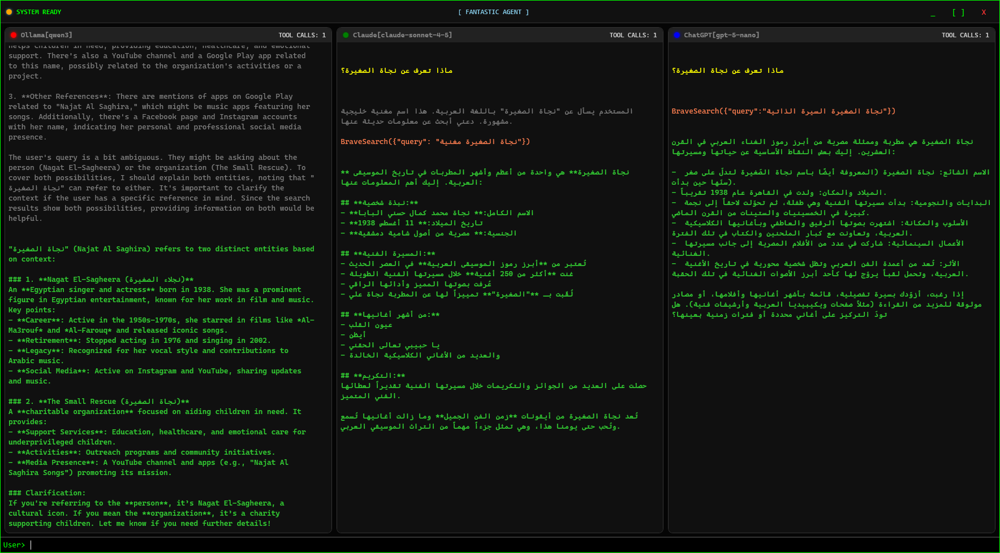

# Fantastic Agent


A lightweight C# library for parallel LLM orchestration with native tool calling support. Run multiple providers simultaneously and compare their responses in real-time.


## Why Fantastic Agent?

- **Native tool calling** - Simple reflection-based function registration that works across providers
- **Event-driven streaming** - Real-time response chunks from all providers
- **Multi-provider support** - Swap between Ollama, Claude, OpenAI without rewriting code
- **Unopinionated architecture** - Build agents your way without framework lock-in


## Quick Start
```csharp
// Create a thread with Ollama
OllamaThread ollama = new OllamaThread(
    "localhost", 
    11434, 
    OllamaModel, 
    "You are a helpful assistant."
);

// Register function tools
ollama.DeclareFunctionTool(typeof(WebSearchProviders).GetMethod("BraveSearch"));

// Subscribe to events
ollama.AssistantReplyChunkReceived += (s, e) => Console.Write(e.Message);

// Send a message and get streaming response
await ollama.SendMessageAsync("Search for the latest AI news");
```

## Demo




The WPF demo shows three LLM providers (Ollama, Claude, ChatGPT) responding to the same Arabic query in parallel, each making tool calls to BraveSearch and streaming results independently.


## Current Status

- [x] Native LLM support with tool calling  
- [x] Multi-provider parallel execution  
- [x] Event-driven streaming  
- [ ] NuGet package (planned)  
- [ ] Full agent orchestration (figuring it out)

## Supported Providers

- Ollama
- Claude (Anthropic)
- OpenAI/ChatGPT


## License

[MIT]